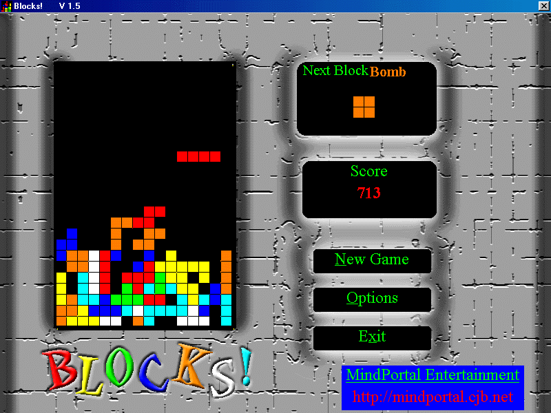



## Blocks\! Game \- Cool Tetris Clone

### Description

Awesome Blocks Game. It is a Tetris clone but better. I features 2 extra blocks that have different abilities. You can use the Bomb Block to your advantage and the Scatter block to your disadvantage. Contains very nice graphics\art.
 
### More Info
 

             |
---                |---
**Submitted On**   |2000-08-10 09:11:58
**By**             |[Kamran Aslam](https://github.com/Planet-Source-Code/PSCIndex/blob/master/ByAuthor/kamran-aslam.md)
**Level**          |Intermediate
**User Rating**    |4.5 (27 globes from 6 users)
**Compatibility**  |VB 5\.0, VB 6\.0
**Category**       |[Games](https://github.com/Planet-Source-Code/PSCIndex/blob/master/ByCategory/games__1-38.md)
**World**          |[Visual Basic](https://github.com/Planet-Source-Code/PSCIndex/blob/master/ByWorld/visual-basic.md)
**Archive File**   |[CODE\_UPLOAD88278102000\.zip](https://github.com/Planet-Source-Code/kamran-aslam-blocks-game-cool-tetris-clone__1-10585/archive/master.zip)

